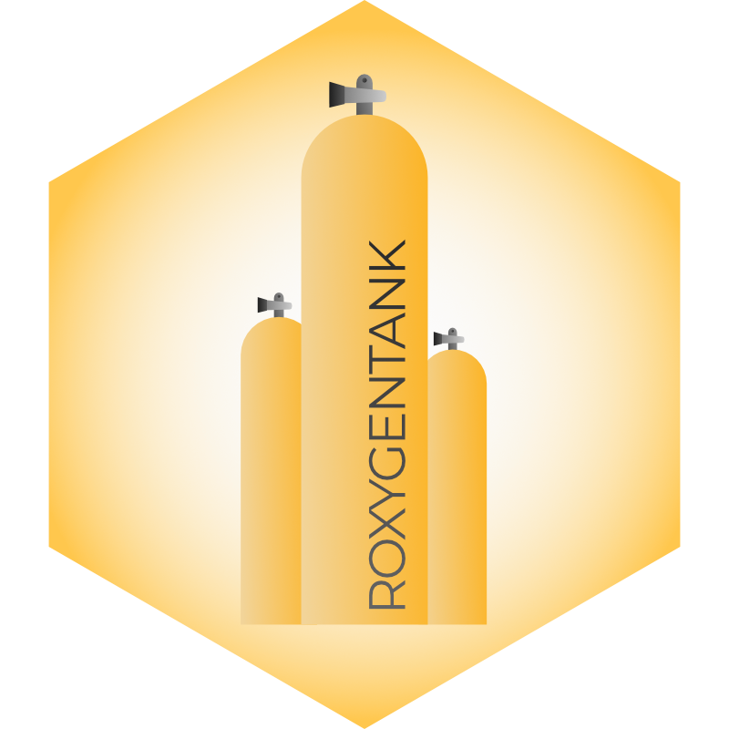

  
<!-- README.md is generated from README.Rmd. Please edit that file -->

```{r setup, include = FALSE}
knitr::opts_chunk$set(
  collapse = TRUE,
  comment = "#>",
  fig.path = "man/figures/README-",
  out.width = "100%"
)
```

# roxygentank </a>

The goal of roxygentank is to provide templates for the documentation of R functions for R packages. 

I find that learning through example is my favoured way of picking up new practices. Here, we get straight to it, substituting prose (mostly) for plain old examples (with explainers alongside the various tags as needed).

Contains both a comprehensive template describing many of the available roxygen formatting, navigation, and functionality tags, as well as a minimal template with the bare-minimum recommended tags and formatting for a single vs. family of functions. 

I don't promise this is "the best of best practices", but its helped me personally use and remember how to roxygen2.

## Installation

You can install from Github via:

``` r
remotes::install_github("robert_amezquita/roxygentank")
```

## Usage

```{r example, eval=FALSE}
## Complete template with documentation of select tags and usage
roxygentank_summary() # creates R/roxygentank_summary.R file

# Minimal template with little prose and pure examples
roxygentank_minimal() # creates R/roxygentank_minimal.R file
```

## Contributing

Feel free to submit a pull request to contribute new templates or enhance the existing templates with better documentation or suggestions for new templates. Some ideas include templates for data functions, common R best practices for error reporting, parsing function args, and usage of common tidyverse programming patterns.
